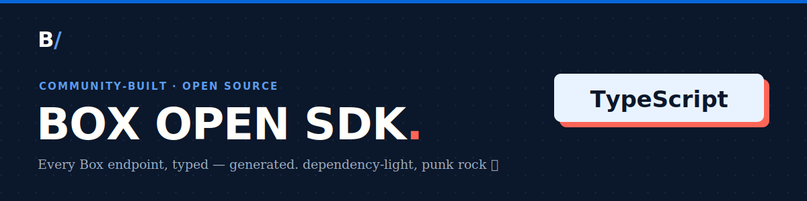

<!-- Generated by box-gantry. DO NOT EDIT — regenerate from the specs instead. -->


# @unofficialbox/box-open-sdk

[](https://www.npmjs.com/package/@unofficialbox/box-open-sdk)

An **open source, community-built** Box API client for TypeScript — fully typed models
for the whole Box surface, one manager per API area behind a single `Client`,
and a `fetch`-based runtime with retry, backoff, and token refresh. Ships as a
**dual ESM/CJS** package with bundled `.d.ts` declarations; no runtime
dependencies.

> **Not affiliated with, authorized, or endorsed by Box, Inc.** "Box" is a
> trademark of Box, Inc. This is an independent, generated client.

## Install

```sh
npm install @unofficialbox/box-open-sdk
```

## Quickstart

Authenticate, look up the current user, create a folder, upload a file, extract
its fields with Box AI, tag it with metadata, and query for it — end to end:

```ts
import { Client, auth } from '@unofficialbox/box-open-sdk';

// Client Credentials Grant (server-to-server); developer token, OAuth, and JWT
// also live in the `auth` namespace.
const client = new Client(auth.clientCredentials({
  clientId: 'CLIENT_ID',
  clientSecret: 'CLIENT_SECRET',
  enterpriseId: 'ENTERPRISE_ID',
}));

// The current user.
const me = await client.users.getMe();
console.log(`authenticated as ${me.id}`);

// Create a folder at the account root ("0").
const folder = await client.folders.create({
  name: 'Invoices',
  parent: { id: '0' },
});

// Upload a file into it.
const uploaded = await client.uploads.uploadFile({
  attributes: { name: 'invoice.pdf', parent: { id: folder.id } },
  file: new Blob(['<file bytes>']),
});
const fileId = uploaded.entries![0].id;

// Extract fields from the file with Box AI.
const answer = await client.ai.extract({
  prompt: 'Extract the invoice number and total amount.',
  items: [{ id: fileId, type: 'file' }],
});
console.log(answer);

// Attach that metadata to the file (an enterprise template).
await client.fileMetadata.createFileMetadata(fileId, 'enterprise', 'invoiceData', {
  invoiceNumber: 'INV-0042',
  total: 1250,
});

// Query for files carrying that metadata.
const results = await client.search.queryByMetadata({
  from: 'enterprise_0.invoiceData',
  ancestor_folder_id: folder.id,
});
console.log(results);
```

## Authentication

The runtime implements Box's four auth flows — **developer token**, **client
credentials (CCG)**, **OAuth 2.0** (with a pluggable refresh-token store), and
**JWT** (server auth, exposed as the Node-only `./jwt` subpath). See
[`docs/auth.md`](./docs/auth.md).

## Documentation

The [`docs/`](./docs/README.md) tree carries the per-manager reference and the
authentication, pagination, and errors guides.

## License

MIT. Generated by [box-gantry](https://github.com/unofficialbox/box-gantry).
